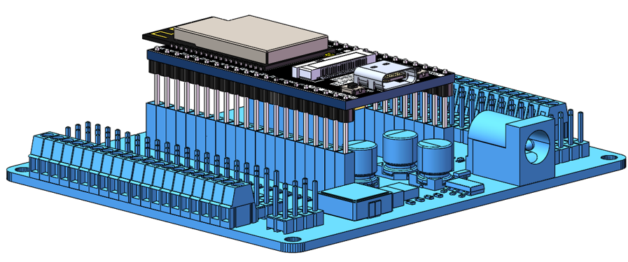
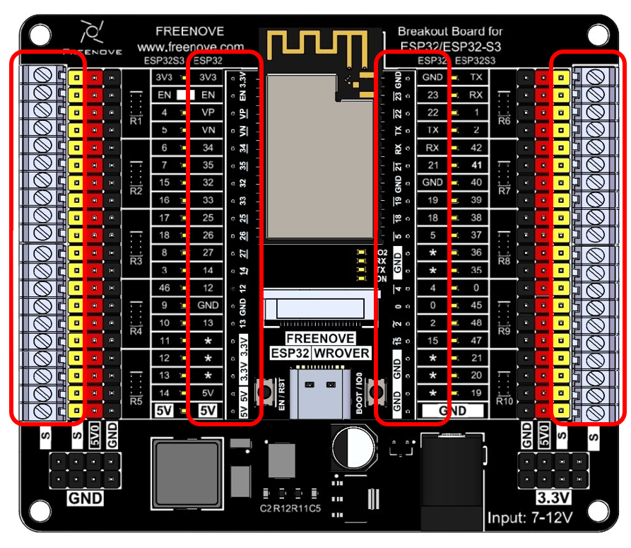
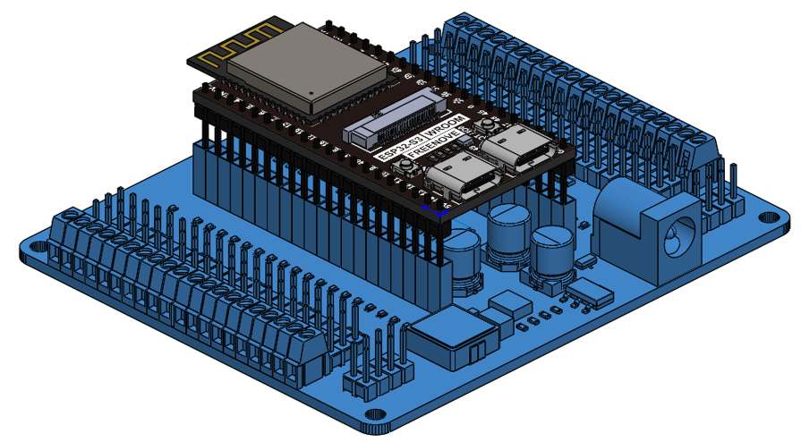
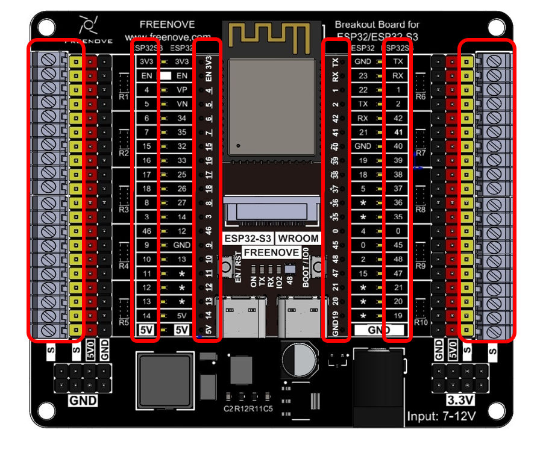
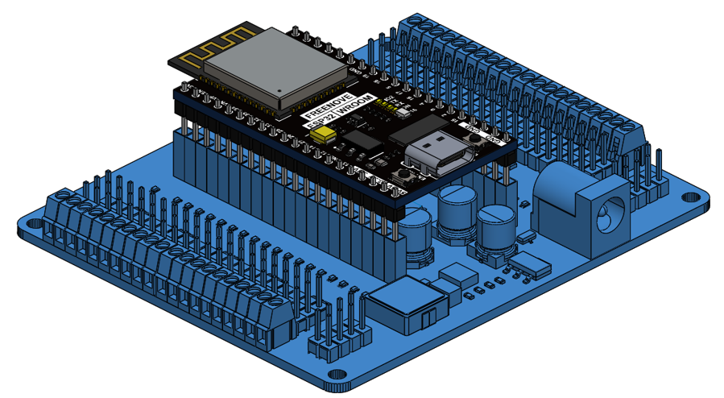
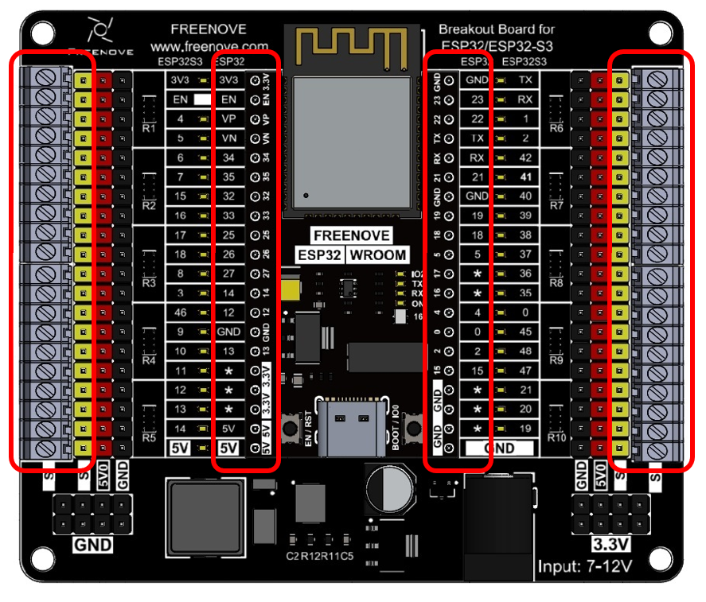

##############################################################################
Chapter 0 ESP32/ESP32S3(Important)
##############################################################################

Project 0.1 Freenove ESP32 WROVER Board
*************************************************

Materials forFreenove ESP32 WROVER Board
=================================================

Download link for Freenove ESP32 WROVER Board:

https://freenove.com/fnk0047/

Or you can visit our github to download: 

https://github.com/Freenove/Freenove_Ultimate_Starter_Kit_for_ESP32_S3

Regarding the programming instructions for the Freenove ESP32S3 WROOM Board, we won't delve into them here. 

If you're interested, please refer to the following resources:

For For C Programming Tutorial, you can check **Freenove_Ultimate_Starter_Kit_for_ESP32\\C\\C_Tutorial.pdf**

For Python Programming Tutorial, you can refer to 

**Freenove_Ultimate_Starter_Kit_for_ESP32\\Python\\Python_Tutorial.pdf**

Board Assembly
================================================

.. table:: 
    :align: center
    :class: table-line
    :width: 80%

    +----------------------------------------------------------------------------------------------------------------------------+
    | Please pay attention to the position of the antenna and ensure that the ESP32S3 is correctly inserted onto the base board. |
    |                                                                                                                            |
    | |Chapter00_00|                                                                                                             |
    +----------------------------------------------------------------------------------------------------------------------------+
    | After assembly:                                                                                                            |
    |                                                                                                                            |
    | |Chapter00_01|                                                                                                             |
    |                                                                                                                            |
    | :red:`Note:`                                                                                                               |
    |                                                                                                                            |
    | :red:`1. For all pins marked “*”, their pin numbers depends on those of the esp32 board in use.`                           |
    |                                                                                                                            |
    | :red:`2. Note: The S terminal of the breakout board directly connects to the pins of the ESP32 board.`                     |
    +----------------------------------------------------------------------------------------------------------------------------+

Project 0.2 Freenove ESP32S3 WROOM Board
*************************************************

Freenove ESP32S3 WROOM Board
===========================================

Download link for Freenove ESP32S3 WROOM Board:

https://freenove.com/fnk0082/

Or you can visit our github to download: 

https://github.com/Freenove/Freenove_Ultimate_Starter_Kit_for_ESP32_S3

Regarding the programming instructions for the Freenove ESP32S3 WROOM Board, we won't delve into them here. 

If you're interested, please refer to the following resources:

For C Programming Tutorial, you can check **Freenove_Ultimate_Starter_Kit_for_ESP32_S3\\C\\C_Tutorial.pdf.**

For Python Programming Tutorial, you can refer to 

**Freenove_Ultimate_Starter_Kit_for_ESP32_S3\\Python\\Python_Tutorial.pdf.**

Board Assembly
==============================================

.. table:: 
    :align: center
    :class: table-line
    :width: 80%

    +----------------------------------------------------------------------------------------------------------------------------+
    | Please pay attention to the position of the antenna and ensure that the ESP32S3 is correctly inserted onto the base board. |
    |                                                                                                                            |
    | |Chapter00_02|                                                                                                             |
    +----------------------------------------------------------------------------------------------------------------------------+
    | After assembly:                                                                                                            |
    |                                                                                                                            |
    | |Chapter00_03|                                                                                                             |
    |                                                                                                                            |
    | :red:`Note: The S terminal of the breakout board directly connects to the pins of the ESP32 board.`                        |
    +----------------------------------------------------------------------------------------------------------------------------+

Project 0.3 Freenove ESP32 WROOM Board
***********************************************

Freenove ESP32 WROOM Board
===============================================

Download link for Freenove ESP32 WROOM Board:

https://freenove.com/fnk0090/

Or you can visit our github to download: 

https://github.com/Freenove/Freenove_ESP32_WROOM_Board

Regarding the programming instructions for the Freenove ESP32S3 WROOM Board, we won't delve into them here. 

If you're interested, please refer to the following resources:

For C Programming Tutorial, you can check **Freenove_ESP32_WROOM_Board\\C\\C_Tutorial.pdf.**

For Python Programming Tutorial, you can refer to **Freenove_ESP32_WROOM_Board\\Python\\Python_Tutorial.pdf.**

Board Assembly
===============================================

.. table:: 
    :align: center
    :class: table-line
    :width: 80%

    +--------------------------------------------------------------------------------------------------------------------------+
    | Please pay attention to the position of the antenna and ensure that the ESP32 is correctly inserted onto the base board. |
    |                                                                                                                          |
    | |Chapter00_04|                                                                                                           |
    +--------------------------------------------------------------------------------------------------------------------------+
    | After assembly:                                                                                                          |
    |                                                                                                                          |
    | |Chapter00_05|                                                                                                           |
    |                                                                                                                          |
    | :red:`Note:`                                                                                                             |
    |                                                                                                                          |
    | :red:`1. For all pins marked “*”, their pin numbers depends on those of the esp32 board in use.`                         |
    |                                                                                                                          |
    | :red:`2. Note: The S terminal of the breakout board directly connects to the pins of the ESP32 board.`                   |
    +--------------------------------------------------------------------------------------------------------------------------+

