##############################################################################
Chapter 1 Example
##############################################################################

This chapter is the Start Point in the journey to build and explore ESP32 electronic projects. We will start with simple “Blink” project.

Project 0.1 Blink
**********************************

In this project, we will use either ESP32 or ESP32S3 to control the blinking of the onboard LED.

Component List
====================================

.. table::
    :align: center

    +-----------------+---------------------+----------------+
    | ESP32 WROVER x1 | ESP32 S3 WROOM 1 x1 | ESP32 WROOM x1 |
    |                 |                     |                |
    | |Chapter01_00|  | |Chapter01_01|      | |Chapter01_02| |
    +-----------------+---------------------+----------------+
    | USB cable                                              |
    |                                                        |
    | |Chapter01_03|                                         |
    +-----------------+---------------------+----------------+

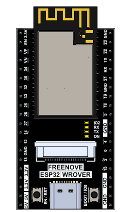
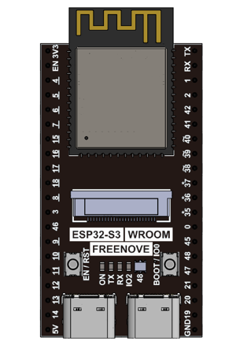
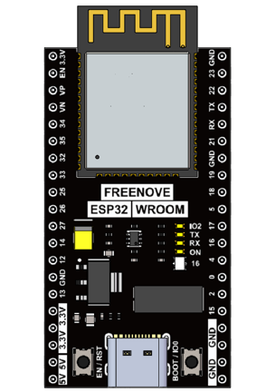

Power
-----------------------------------

ESP32 WROVER and ESP32S3 WROOM needs 5v power supply. In this tutorial, we need connect ESP32-WROVER to computer via USB cable to power it and program it. We can also use other 5v power source to power it.

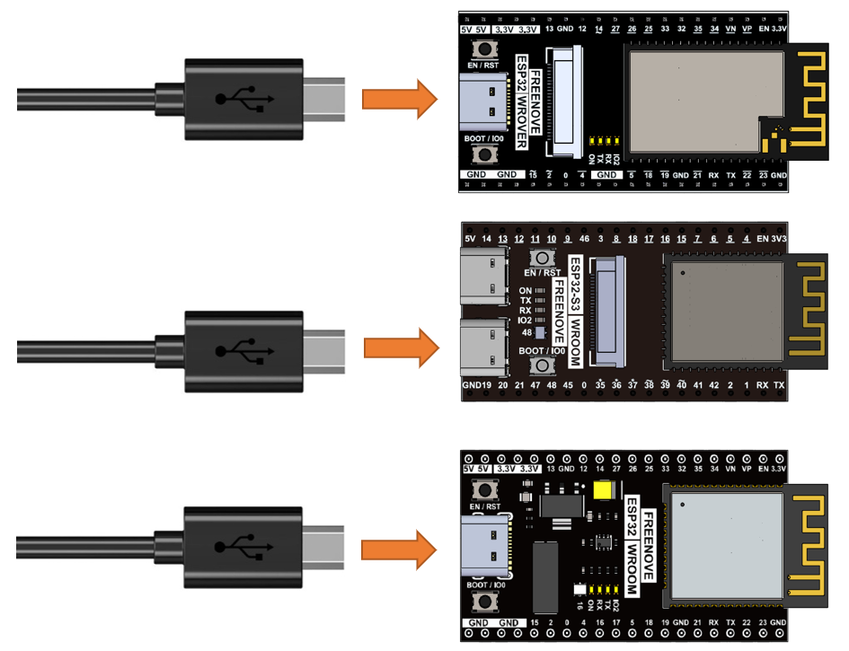

Sketch
===================================

If you are not familiar with programming ESP32 WROVER or ESP32S3 WROOM development boards, please start by downloading the following resources and studying them:

ESP32 WROVER: https://github.com/Freenove/Freenove_Ultimate_Starter_Kit_for_ESP32

ESP32S3 WROOM: https://github.com/Freenove/Freenove_Ultimate_Starter_Kit_for_ESP32_S3

ESP32 WROOM: https://github.com/Freenove/Freenove_ESP32_WROOM_Board

Here we take ESP32 WROVER as an example and develop with Arduino IDE. Upload the following sketch.

Freenove_Ultimate_Starter_Kit_for_ESP32\\Sketches\\Sketch_01.1_Blink.

Before uploading the code, click "Tools", "Board" and select "ESP32 Wrover Module".

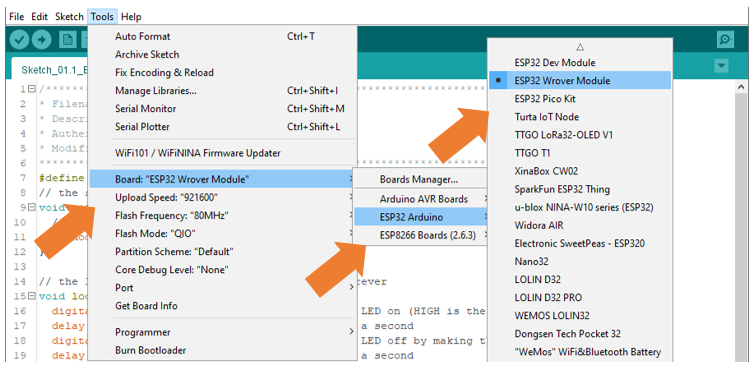

Select the serial port.

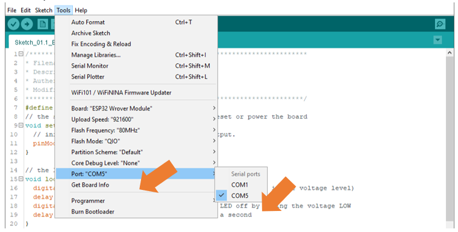

.. note::
    
    **For macOS users, if the uploading fails, please set the baud rate to 115200 before clicking “Upload Using Programmer”.**

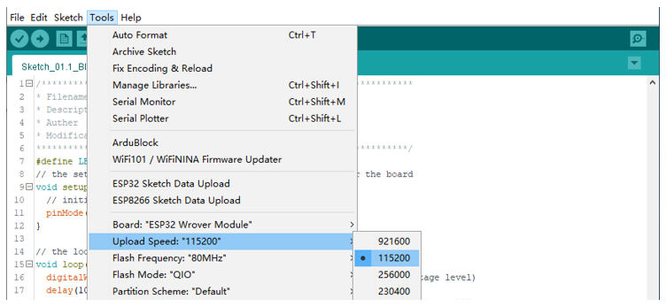

Sketch_01.1_Blink
-----------------------------------

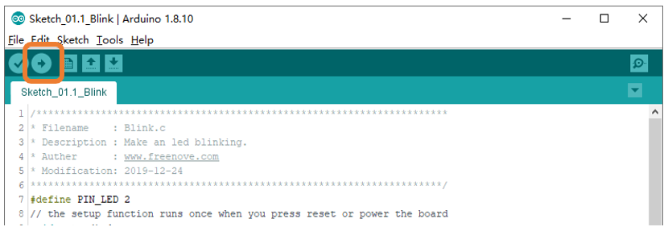

Click “Upload”, Download the code to ESP32-WROVER and your LED in the circuit starts Blink.

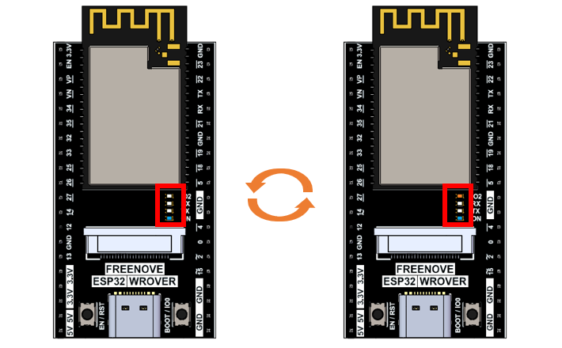

Disconnect the USB data cable. Install the ESP32 WROVER onto the Freenove Breakout Board for ESP32 as shown in the image below:

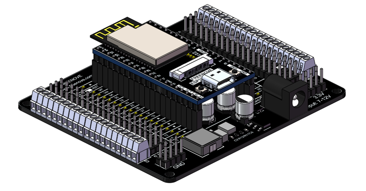

Power the board using an external power supply or connect the ESP32 WROVER via a USB cable. You will observe that the onboard indicator LED will also blink accordingly. 

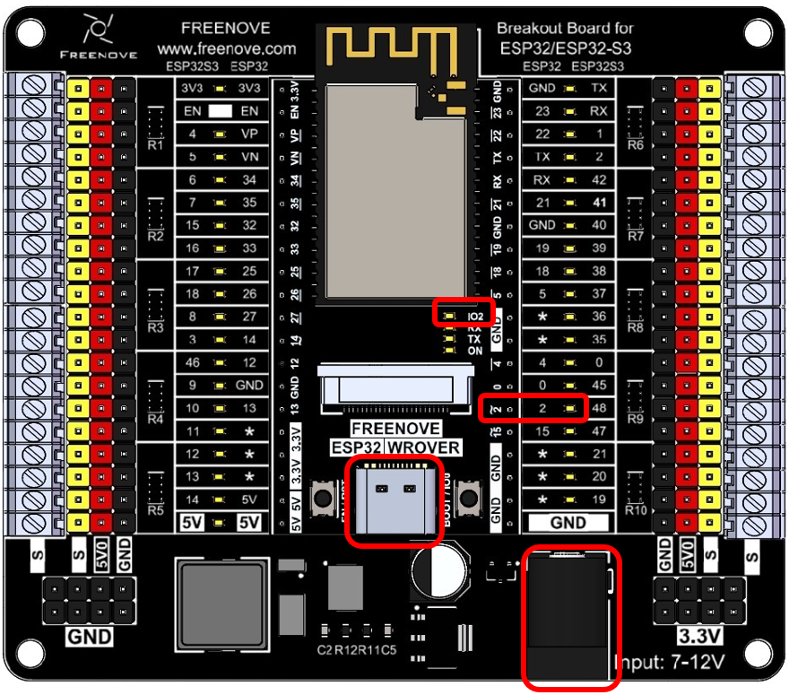