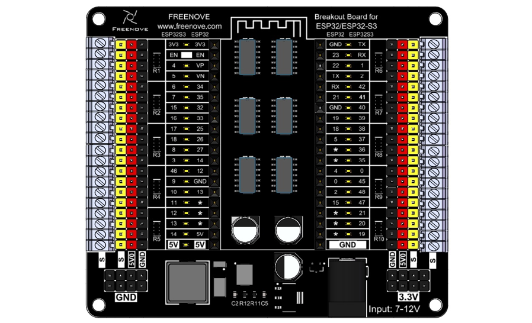
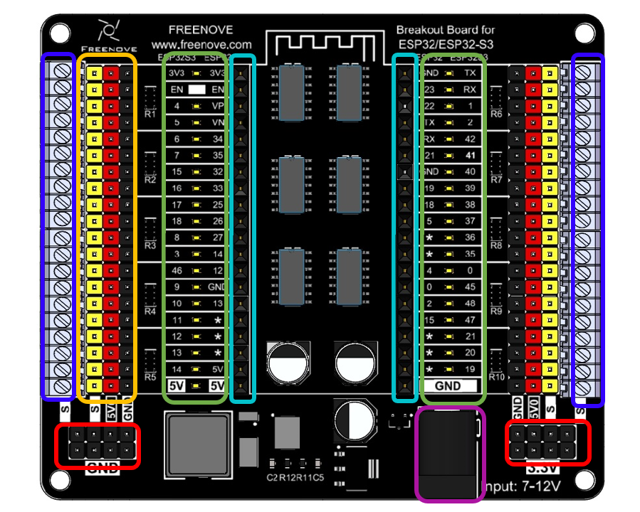
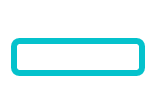

##############################################################################
Preface
##############################################################################

The Freenove Breakout Board for ESP32 is a circuit board based on either the Freenove ESP32 Wrover Board or the Freenove ESP32 S3 Wroom Board. It is highly practical for various external expansion projects.

If you haven't downloaded the related material for Raspberry Pi Pico tutorial, you can download it from this link:

https://github.com/Freenove/Freenove_Breakout_Board_for_ESP32/archive/refs/heads/master.zip

After completing the projects in this tutorial, you can also combine the components in different projects to make your own smart homes, smart car, robot, etc., bringing your imagination and creativity to life with Freenove Breakout Board for ESP32.

If you have any problems or difficulties using this product, please contact us for quick and free technical support: support@freenove.com

Freenove Breakout Board for ESP32
*******************************************

Before learning Freenove Breakout Board for ESP32, we need to know about it. Below is an imitated diagram of Freenove Breakout Board for ESP32, which looks very similar to the actual Freenove Breakout Board for ESP32.

Notes: 

1.	The onboard LED indicators present the level of their corresponding pin. When the pin is high, its indicator lights up; when it is low, the LED is off. :red:`However, please note that all the pins are floating when not used, so you may see the LEDs light up or off randomly and their status may change when touched by fingers. You can set all the pins to high or low for stable LED behavior.`

2.	The Freenove Breakout Board for ESP32 supports both the Freenove ESP32 and Freenove ESP32S3 boards. :red:`Please pay attention to the orientation of the ESP32 board when using it. Inserting it incorrectly or misaligning it could lead to board damage.`

3.	The 5V0 is powered by the DC jack, and it supports a maximum ourput current of 3A. 

4.	For all pins marked “*”, their pin numbers depends on those of the esp32 board in use. This is because we have issued various versions of esp32 board with different pinout.

5.	The S terminal directly connects to the ESP32 board, with a level range of 0-3.3V.

6.	Most electronic modules in the market apply TTL signals, with some powered by 3.3V and others by 5V. According to the TTL Logic Levels, the range of high level is 2-5V and low ranges from 0 to 0.8V. Therefore, even if a 5V device is used, it can still be driven by the pins of the S Terminal. However, if level conversion chip is added to the circuit, it will cause malfunction to the 3.3V devices.

7.	The power supply of the 3.3V pins depends on whether you connect power supply to USB or DC jack. 

The hardware interfaces are distributed as follows: 

.. table:: 
    :align: center
    :class: table-line

    +--------------+------------------------------------------------------------------------------------------------------------------------------------------------------------------+
    | |Preface_02| | External Power Interface: Please use a 7-12V power supply, and it is recommended to use a 12V 5A power supply.                                                   |
    +--------------+------------------------------------------------------------------------------------------------------------------------------------------------------------------+
    | |Preface_03| | Power Supply Interface: Please note that the 3.3V interface can only output a maximum of 0.5A current.                                                           |
    |              |                                                                                                                                                                  |
    |              | It is suggested for powering external chips and not recommended for use in external high-current circuits.                                                       |
    +--------------+------------------------------------------------------------------------------------------------------------------------------------------------------------------+
    | |Preface_04| | ESP32/ESP32S3 Interface: Pay attention to the antenna's position and do not insert the ESP32/ESP32S3 reversely.                                                  |
    |              |                                                                                                                                                                  |
    |              | When inserting, ensure the interface is correctly connected before applying power to the power supply interface to avoid damaging the board due to misalignment. |
    +--------------+------------------------------------------------------------------------------------------------------------------------------------------------------------------+
    | |Preface_05| | Indicator LED Circuit: LEDs can indicate the level status of ESP32/ESP32S3 pins.                                                                                 |
    |              |                                                                                                                                                                  |
    |              | The inner row of silkscreen indicates the pin distribution for the ESP32, while the outer row is for the ESP32S3.                                                |
    +--------------+------------------------------------------------------------------------------------------------------------------------------------------------------------------+
    | |Preface_06| | Pin Expansion: The yellow header connects to the ESP32/ESP32S3 interface.                                                                                        |
    |              |                                                                                                                                                                  |
    |              | The red header receives power from the external power supply, supporting a maximum of 3A current.                                                                |
    |              |                                                                                                                                                                  |
    |              | The black header connects to the external power ground.                                                                                                          |
    +--------------+------------------------------------------------------------------------------------------------------------------------------------------------------------------+
    | |Preface_07| | Pin Expansion: Terminal blocks connect to the ESP32/ESP32S3 interface.                                                                                           |
    +--------------+------------------------------------------------------------------------------------------------------------------------------------------------------------------+

